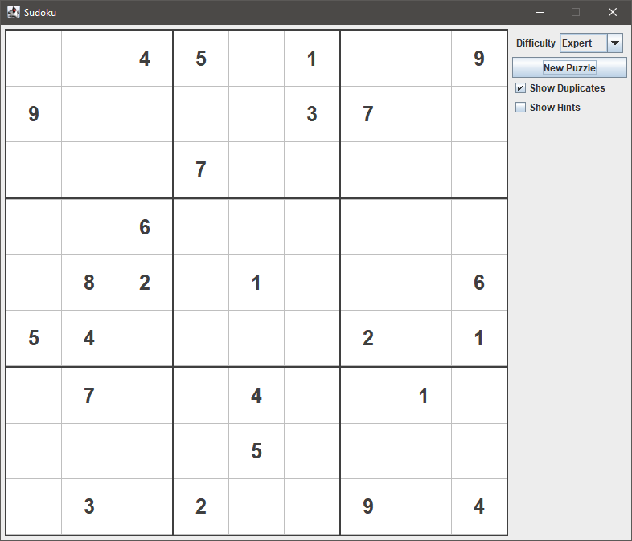
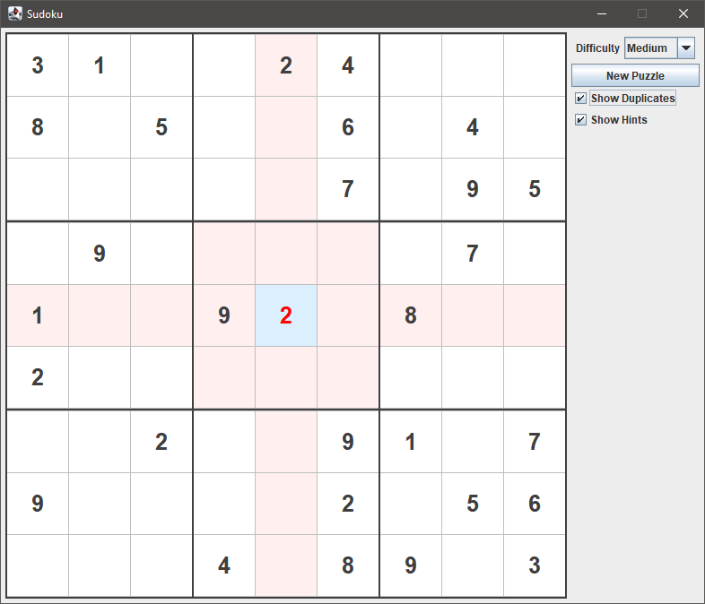

# Sudoku Factory
An app for generating and playing random Sudoku puzzles of varying difficulty.

## Table of Contents
* [General Info](#general-information)
* [Built with](#built-with)
* [Key Feature](#key-features)
* [Setup](#setup)
* [Usage](#usage)
* [Acknowledgements](#acknowledgements)
* [Contact](#contact)

## General Information
- Generates random, legal Sudoku puzzles of varying difficulty. For a puzzle to be legal, it can 
  only have a single solution. The difficulty is determined by the amount of clues on the board.
- Lets the user play the generated Sudoku puzzle in a graphical user interface, which can 
  provide visual feedback on duplicates in a grid, or provide hints on grids, columns and rows 
  that are incorrect. It was implemented using Java Swing, and the MVC pattern.
- The project was created in collaboration with another developer using the agile methodology 
  [Kanban](https://www.atlassian.com/agile/kanban) and [Test-Driven Development](https://en.wikipedia.org/wiki/Test-driven_development).
  The used workflow and guidelines can be seen in detail [here](workflow.md).
- The main purpose of the project was to practice working as a team using an agile methodology; 
  a git workflow with feature branches, pull-requests and code reviews; and using Test-Driven 
  Development to guide the design process by writing *good* unit tests. In other words, tests 
  that are independent, reliable, readable and fast.

  
  
  *Fig 1. A simplified UML class diagram of the application architecture.*
    
  
  Two design principles in particular guided the overall architecture and class design in order 
  to facilitate testing: the single responsibility principle and avoiding side effects. This 
  included avoiding classes creating their own dependencies, and using dependency injection instead.

## Built with
- Java Swing - JDK16
- Maven - version 3.6.3
- JUnit - version 5.8.2
- Mockito - version 4.5.1

## Key Features
- Can generate an endless amount of random, single-solution Sudoku puzzles of varying difficulty.
- Lets you play any generated puzzle right away.
- Provides an easy-to-use graphical interface.
- Users can enable or disable visual feedback for duplicate digits, and show hints if they so 
  desire.

## Setup
Requires Maven (the earliest tested version is 3.6.3) and JDK16+.

1. Clone the project from GitHub.
2. Navigate to the directory containing the project.
3. Run the command `mvn package` from the command line and wait for it to finish.
4. Navigate to the target directory: `cd target`.
5. Run the command `java -jar sudoku-1.0-SNAPSHOT.jar` to run the application.

## Usage
When the application first starts, you can generate a new puzzle by selecting a difficulty from 
the right-hand panel and clicking the *New Puzzle* button. The selected difficulty will determine 
how many clues the puzzle will have. You can keep generating as many new puzzles as you want.

You can play a generated puzzle by clicking on an empty tile to select it, and using the 
keyboard to set the value. The keys *1-9* set the corresponding value, while the keys *0*, 
*delete* and *backspace* clear the tile.

The currently selected tile is marked with a light blue background. Digits that you can edit are 
colored blue, while clues are black. If *Show Duplicates* is enabled in the right-hand panel, 
editable digits with a duplicate in a row, column or block are colored red. If you prefer not to 
see duplicates, simply disable *Show Duplicates*.

Another option that can be enabled is *Show Hints*. This will highlight blocks, columns and 
rows red if they contain digits added by the user that are incorrect.

When the entire puzzle is solved, the background will be colored green to reflect this.

## Acknowledgements
Many thanks to Rasmus Djupedal for collaborating on this project.

## Contact
Created by [Simon Karlsson](mailto:a.simon.karlsson@gmail.com) - feel free to contact me!

