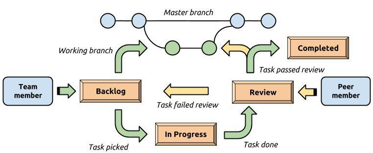

# Workflow and Guidelines
# Task Guidelines
Tasks represent a single activity that needs to be completed. There are several types of
activities, denoted by one or more of the following labels:

- **FEATURE** = Green: a feature to be implemented.
- **PATCH** = Light Blue: a modification to the behavior of an already implemented task.
- **TEST** = Yellow: a test case to be implemented.
- **BUG** = Red: a problem that needs to be fixed.
- **TECHNICAL** = Dark Blue: changes that do not alter behavior or implementation details, such
  as documentation or Git management.

A task can have more than one label. For example, labels can be added when a task is peer
reviewed as per [peer review guidelines](#peer-review-guidelines).
For each label on a task card, a corresponding header is added with a description.

## FEATURE
Means the implementation of new behavior. The descriptions should specify *what* to implement,
but can also describe *how* (implementation details) and *why*.

## TEST
Even though all implemented behavior should include tests, it is not mandatory to add a
**TEST** tag to a task. Tests will be added when the task is implemented either way, and it is
not efficient, or always possible even, to exhaustively come up with all test cases in advance.
Use the **TEST** label when you want to document some necessary test cases in advance, or find
a test case that is missing during peer review.

## BUG
When something isn't working as intended, or causes unintentional side effects or other
problems. Should include a report of the current behavior, and what it should be doing instead.

## PATCH
When you want to change intended behavior. In other words, it is not a bug fix but a change
from the current implementation.

## TECHNICAL
For changes that do not concern the program's behavior. This can be things such as
documentation or Git management.

---

# Git Workflow



- When starting work on a task, move it from the **Backlog** to **In Progress**, and set
  yourself as owner of the card (*Right-hand menu > Members*).
  Create a new git branch with the naming convention `task/name-in-kebab-case`, where task is the
  task type (feature, bug, patch), and the name is the name of the task card. If a task has
  several labels, use the most appropriate label. Typical priority is Feature > Bug > Patch >
  Test > Technical. Example: `feature/create-game-board`
- When working on the task, commit all work to this new branch. Try to favor frequent, small
  commits. This makes it easier to go back if future changes introduce problems.
- When the task is finished, make a pull request to the master branch, and move the task card
  to the **Review** column. Change the owner of the card to the member who will perform the
  review (*Right-hand menu > Members*), and add a link to the branch on Bitbucket at the top of
  the card.
- Another contributor must peer review the task, according to the [peer review guidelines](#peer-review-guidelines).
- If the task passes the review, it is tagged with the **ACCEPTED** label. Otherwise, it is
  marked with the **DECLINED** label and moved to the top of **Backlog**.
- When your task is marked with **ACCEPTED**, you can merge it to the master branch, and move
  the task card to the **Completed** column.

---

# Peer Review Guidelines
Before a task is deemed to be finished, and can be moved to the *Completed* column, it must
pass a peer review. To mark a task for review, move it to the **Review** column, and change the
owner of the card to the member who will perform the review (*Right-hand menu > Members*). Also
make sure to include a link to the branch on Bitbucket at the top of the card!

To pass a peer review, a task must conform to the requirements laid out by the task card, and
conform to the [code conventions](#code-conventions) and [documentation guidelines](#documentation-guidelines).

It is also possible for the reviewer to uncover requirements that were not stated in the
original task, but which may cause issues if not addressed. In such a case, tag the task with
the **PATCH** label and add the new requirements under the **PATCH** header in the description.

Similarly, if there is an issue with the implementation, add the **BUG** tag and add relevant
information under the **BUG** header in the descriptions. The same approach can be applied with
**TEST** and **TECHNICAL** as well.

If a task fails the review, the reviewer tags the task with the label **DECLINED** puts it at
the top of the **Backlog** column for it's owner to pick back up. If it is approved, the
reviewer tags it with the **ACCEPTED** label. Once the owner has merged the task's branch into
the master branch, he/she can move it to the **Completed** column.

---

# Code Conventions
**Be explicit:** Try to not rely on context, or implicit understanding. Don’t favor making code
shorter or “more efficient” at the cost of being clear and explicit.

**Single responsibility principle:** A method or class should have a single responsibility. If
you find that it is doing several different things, consider refactoring into several smaller
methods or classes. This will increase cohesion and lower coupling. It also leads to more
easily testable code.

**Do not repeat yourself (DRY)**: If you find that you are repeating the same or similar code
in multiple places, consider breaking the code out into its own function.

**Fail early, fail hard:** If the program runs into an exception, it is often better to let the
exception be thrown (add the `throws` clause to the method) than catching and suppressing it
early. Catching the error can hide it, making it harder to figure out problems down the line.

Also, always strive to catch and throw appropriate exceptions; remember to be explicit and
don't just use the most general type `exception`.

**Writing testable code:** Avoid side effects with your code. One example is classes and
methods that create their own dependencies, i.e. they create the things they need themselves.
Instead, consider passing this dependency as a parameter instead - ideally as an interface. It
will make the code more easy to test.

**Test one thing**: A unit test should test a single behavior, and should not affect, or be
affected by, other tests.

**Writing unit tests:** The [AAA](http://wiki.c2.com/?ArrangeActAssert) pattern can be used to
format a unit test:

1. **Arrange** all necessary preconditions and inputs.
2. **Act** on the object or method under test.
3. **Assert** that the expected results have occurred.

If it is hard to write a unit test, it's an indication that there might be a problem with the
code being tested. In such cases, consider refactoring the code.

Try to avoid testing specific implementation details. Instead focus on testing the behavior
that you want (or don't want) the code to exhibit. Too much emphasis on testing the details of
an implementation can lead to tight coupling between unit tests and implementation details,
which means the code can't be refactored without also changing the tests. This can lead to
developers not refactoring the code out of a fear of breaking the tests.

**Input for unit tests:** Avoid random functions, loops, and conditionals in unit tests. If you
want to test the state after adding items, `0`, `1` and `2` items is enough. Focus on testing
edge cases. That is, values that are *just* inside and outside the allowable range of values.
That is where most errors tend to happen. Also test `null` inputs where appropriate.

## Naming
**Classes and interfaces:** `CamelCase`.

**Packages:** lowercase without separation between words, e.g. `com.somepackage`.

**Methods:** `pascalCase`. Method names should be verbs, e.g. `calculateResult`. However,
adjectives may suit methods that return booleans better, e.g. `isEmpty`, `greaterThan`.

**Constants:** uppercase with `_` separating words, e.g. `CONSTANT_VALUE`.

**Variables:** use descriptive names. Try to avoid just a single letter, except where it is
explicit and obvious, such as in for-loops. Avoid long names with metadata (*number*, *map*,
*set*, etc.). A variable name should easily tell the reader what it represents:

```java
//Avoid (❌) - Too detailed variable naming
int schoolIdentificationNumber;
int[] userProvidedSchoolIds;
int[] schoolIdsAfterRemovingDuplicates;
Map<Integer, User> idToUserMap;
String valueString;

// Prefer (✔️) - Variable names short and descriptive
int schoolId;
int[] filteredSchoolIds;
int[] uniqueSchooldIds;
Map<Integer, User> usersById;

// Prefer (✔️) - Include unit in variable name or type
long pollIntervalMs;
int fileSizeGb;
Amount<Integer, Data> fileSize;

```

In general, avoid acronyms and abbreviations. However, acronyms that are widely known and used,
such as HTTP and XML can be used. Such acronyms should be treated as regular words and not be
fully capitalized, e.g. `XmlReader` for classes, or `sendHttpRequest` for methods.

**Unit tests**: Name testing classes after the class they are testing: `ClassName` becomes
`ClassNameTest`.

Each test should have a descriptive name that makes it clear what is being tested. Adding
`test` to the name is unnecessary since it already has the `@test` annotation. Use descriptive
names that make it clear what is being tested.

```java
//Avoid (❌)
@Test
public void testAddingTwoNumbers()

// Better (✔️)
@Test
public void addingTwoNumbers()

// Best (✔️) - include expected behavior
@Test
public void addingTwoNumbersReturnsCorrectAnswer()

```

## Code Style
**Indentation:** 4 spaces. Line wraps should be (at least) double the indentation, 8 spaces.

**Line length:** 100 gives a “*balance between fewer continuation lines but still easily
fitting two editor tabs side-by-side on a reasonably-high resolution display.*”

**Spacing:** Use spaces between operators, and before opening braces:

```java
// Avoid (❌)
int foo=a+b+1;

// Prefer (✔️)
int foo = a + b + 1;

// Avoid (❌)
if(a==b){
    statement;
}

// Prefer (✔️)
if (a == b) {
    statement;
}

```

**Line breaks:** Avoid the temptation of saving 1–2 lines of code at the expense of readability.
Can be used anywhere it improves readability, or you want to logically separate code. For
example, adding a blank line before a line comment and after the code it comments on. Always
add 1 blank line between methods, and other blocks that end with `}`.

```java
// Avoid (❌) - No separation between methods
public void method() {
    ...
}
public void anotherMethod() {

// Prefer (✔️)
public void method() {
    ...
}

public void anotherMethod() {

// Avoid (❌) - No logical separation
someMethod();
// comment explaning the next two lines
int newVariable();
doSomething(newVariable);
someOtherMethod();

// Prefer (✔️) - Separate commented code with blank lines
someMethod();

// comment explaning the next two lines
int newVariable();
doSomething(newVariable);

someOtherMethod();

```

**Methods:** Prefer parameters on their own lines if there are many:

```java
// Prefer (✔️) - Easy scanning and extra column space.
public String downloadAnInternet(
        Internet internet,
        Tubes tubes,
        Blogosphere blogs,
        Amount<Long, Data> bandwidth
) {
    tubes.download(internet);
    ...
}

```

**If-statements:** do not omit braces on multi-line if statements. Short, one-line statements
can omit bracers. When using line wrapping with several statements, put `&&` or `||` on the new
line. Also when line wrapping, make sure the indentation of conditionals isn’t the same as the body.

```java
// Avoid (❌) - Do not omit {} on multi-line statements
if (condition)
  statement;

// Prefer (✔️)
if (condition) {
  statements;
} else if (condition) {
  statements;
} else if (condition) {
  statements;
}

// Prefer (✔️) - Can skip {} on short one line statements
if (x < 0) return true;

// Avoid (❌)
if ((condition1 && condition2)
    || (condition3 && condition4)
    ||!(condition5 && condition6)) { // BAD WRAPS
    doSomethingAboutIt(); // MAKE THIS LINE EASY TO MISS
}

// Prefer (✔️)
if ((condition1 && condition2)
        || (condition3 && condition4)
        ||!(condition5 && condition6)) {
    doSomethingAboutIt();
}

```

**Multi-line mathematical expressions and String concatenation:** Put operators on the new line
with the value:

```java
// Avoid (❌) - Operator on previous line
int sum = value1 +
          value2 +
	      value3;

// Prefer (✔️) Operator on same line as value
String concatenatedString = string
                            + "some additional text"
                            + string2;

```

**Operator precedence:** Be explicit by using parenthesis to indicate operator precedence:

```java
// Avoid (❌)
return a * 8 * n + 1 / 4;

// Prefer (✔️)
return (a * (8 * n) + 1) / 4;

```

**Method chaining:** If there are several method calls, put them on their own line:

```java
// Avoid (❌)
int result = someMethod(value).doSomething(anotherValue)
    .process().finish();

// Prefer (✔️)
int result = someMethod(value)
    .doSomething(anotherValue)
    .process()
    .finish();

```

**Favor readability:** If there is an ambiguous and unambiguous choice—always go with the
unambiguous:

```java
// Avoid (❌) - it may be difficult to tell 1 and l apart
long count = 100l + n;

// Prefer (✔️)
long count = 100L + n;

```

**Imports:** Avoid wildcard imports, e.g. `import java.util.*;`. If using IntelliJ, this can be
changed with the settings: *IntelliJ > Settings > Editor > Code Style > Java > Imports > Change
“Class count to use import with ‘\’” and “Names count to use static import with ‘\’”.*

Some examples are taken from
[A short summary of Java coding best practices](https://rhamedy.medium.com/a-short-summary-of-java-coding-best-practices-31283d0167d3),
and [Twitter’s Java Style Guide](https://github.com/twitter-archive/commons/blob/master/src/java/com/twitter/common/styleguide.md#variable-naming).

---

# Documentation Guidelines

## Annotations

**Override:** Always use `@Override` annotation when overriding.

**Null values:** Use `@Nullable` when a field or method returns null.

## Comments

Try to write comments that explain *why* the code is implemented the way it is, not *what* it
is doing. If a comment explaining what the code is doing is necessary, consider refactoring the
code to make it more clear instead.

**TODO and FIXME:** Use `TODO` for things that need to be implemented, and `FIXME` for problems
that need to be revisited. These are different from regular comments because they are actionable.
Consider leaving a reference to yourself with the comment so other know who to ask about it.

```java
// FIXME (Steve): need to figure this out
// TODO (Steve): need to implement

```

## Javadoc

Use javadoc (`/**`) to document all classes and *public* methods. Should document what the
class/method *does*. Avoid unnecessary metadata, such as “*An abstract class that...*”. Public
methods should include tags (with explanations):

- `@param` to explain each parameter,
- `@returns` to explain the return value for non-void methods, and
- `@throws` to explain thrown exceptions.

There should be an empty line between the overall description of the method, and the tags.
Javadoc (and tags) can be used for private methods as well, but isn’t strictly mandatory.

```java
// Avoid (❌) No tags
/**
* Takes a mathematical expression in infix notation and
* returns the same expression as a list of tokens
* (values and operations).
*/
private List<String> parseExpression(String expression)
        throws IllegalArgumentException {

// Avoid (❌) No blank line before tags
/**
* Returns whether the connection is currently available,
* or in use.
* @return whether the connection is available.
*/
public boolean connectionIsAvailable() {

// Prefer (✔️)
/**
* Takes a mathematical expression in infix notation and
* returns the same expression as a list of tokens
* (values and operations).
*
* @param expression the infix mathematical expression
*                   to parse.
* @return a list of tokens in infix notation order.
* @throws IllegalArgumentException if given expression
*                                  isn't a valid
*                                  mathematical expression.
*/
private List<String> parseExpression(String expression)
        throws IllegalArgumentException {

```

Some insight on how to write meaningful documentation from Twitter’s Java style guide:

```java
// Avoid (❌) - The doc tells nothing that the method
// declaration didn't. This is the 'filler doc'.
// It would pass style checks, but doesn't help anybody.
/**
 * Splits a string.
 *
 * @param s A string.
 * @return A list of strings.
 */
List<String> split(String s);

// Better (✔️) - We know what the method splits on.
// Still some undefined behavior.
/**
 * Splits a string on whitespace.
 *
 * @param s The string to split. An {@code null} string
 *          is treated as an empty string.
 * @return A list of the whitespace-delimited parts
 *         of the input.
 */
List<String> split(String s);

// Great (✔️) - Covers yet another edge case.
/**
 * Splits a string on whitespace. Repeated whitespace
 * characters are collapsed.
 *
 * @param s The string to split. An {@code null} string
 *          is treated as an empty string.
 * @return A list of the whitespace-delimited parts
 *         of the input.
 */
List<String> split(String s);

```

## Unit tests

Use descriptive names for unit tests, as outlined in
[code conventions](#code-conventions).

Use the annotation `@DisplayName` to describe what is being tested, and what the expected
outcome is. If it is difficult to clearly state, it is a sign that perhaps the test is too
complex. Consider refactoring the test, or the code being tested.

```java
@Test
@DisplayName("Adding 1 + 1 returns 2")
public void addingTwoNumbersReturnsCorrectAnswer()

```

However, if a test would benefit from more documentation - such as describing the input, what
is being tested, and the conditions under which the test passes - then javadoc can be used to do so.

Some examples are taken from
[A short summary of Java coding best practices](https://rhamedy.medium.com/a-short-summary-of-java-coding-best-practices-31283d0167d3),
and [Twitter’s Java Style Guide](https://github.com/twitter-archive/commons/blob/master/src/java/com/twitter/common/styleguide.md#variable-naming).

---